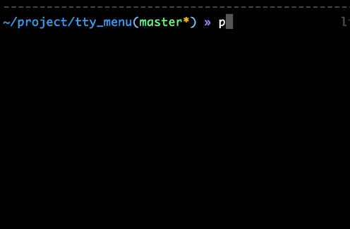

tty_menu
=======
This project is used to create menu command-line
一个快速创建命令行菜单的工具

----

Platforms :  OSX, Linux

----

Example :

.. code-block:: python

    from tty_menu import tty_menu

    l = ['a', 'b', 'c']
    pos = tty_menu(l, "What is your word?")

    print("Your word is %s" % (l[pos]))
